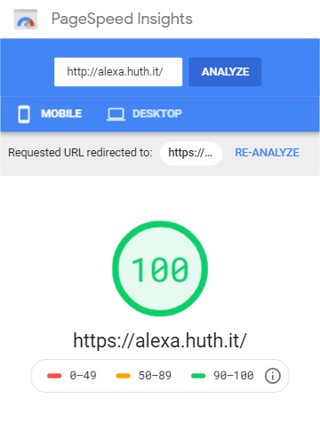

A small page for the german twitch streamer-girl Alexa. This repository was created with laravel-mix (without laravel) and tailwind by using the git template [laravel-mix-standalone-w-tailwind](https://github.com/NormanHuth/laravel-mix-standalone-w-tailwind).

Site:  
https://alexa.huth.it  
https://twitch-hallo-alexa.de (Currently offline)

Pure Css Animated Background Mohammad Abdul Mohaiman:  
https://codepen.io/mohaiman/pen/MQqMyo

Support Alexa:  
hallo_alexa_ on [Twitch](https://www.twitch.tv/hallo_alexa_)  
hallo_alexa_ on [Instagram](https://www.instagram.com/hallo_alexa_/)  
hallo_alexa_ on [Twitter](https://twitter.com/alexa_hallo)
---  
###### 14kB CSS  

